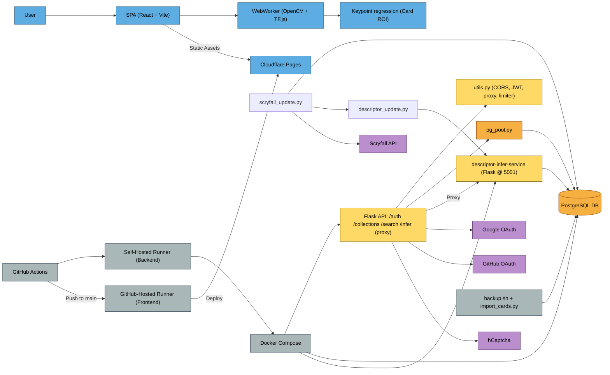

# [mtgscan.cards](https://mtgscan.cards) – Monolithic Design Documentation

## Stack Overview

* **Frontend**: React + Vite (static SPA)
* **Backend**:
  - `core-api`: Flask (auth, collections, search, proxy)
  - `descriptor-infer-service`: Flask (FAISS descriptor matching, Scryfall + descriptor updates)
* **Database**: PostgreSQL (Users, Collections, Cards)
* **Auth**: OAuth (Google/GitHub), JWT (access + refresh cookies)
* **Deployment**: GitHub Actions → Self-hosted runner → Docker Compose
* **Networking**: TLS via Cloudflare DNS + NGINX Proxy Manager

---

## Deployment Workflow

### Backend Deployment

* **Target:** Self-hosted production server
* **Triggered by:** Manual `workflow_dispatch` (`deploy backend`)
* **Branch:** Deploys `main` → `prod` (forced update before deployment)
* **Runner:** `prod-runner` (self-hosted)
* **Steps:**

  ```bash
  git pull origin prod
  docker-compose down
  docker-compose up -d --build
  ````

* **Deploys:**

  * Flask API (`/auth`, `/collections`, `/search`, `/infer` \[proxy only])
  * Descriptor inference service (`/infer` internal only)
  * PostgreSQL database (`mtg-db`)
  * Volumes: `pg_data`, `scryfall_data`

---

### Frontend Deployment

* **Target:** Cloudflare Pages

* **Triggered by:** Manual `workflow_dispatch` (`deploy frontend`)

* **Branch:** Deploys from `prod`

* **Runner:** GitHub-hosted

* **Steps:**

  ```bash
  npm install
  npm run build
  wrangler pages deploy vite-frontend/dist
  ```

* **Deploys:**

  * Static frontend SPA
  * Hosted globally on Cloudflare CDN

---

## Backup Strategy

* `cards` table excluded from SQL dumps (too large)
* Manual backup:

```bash
docker exec mtg-db pg_dump -U mtguser mtgdb --exclude-table=public.cards > backup/mtgdb_$(date +%F).sql
tar -czf backup/data_$(date +%F).tar.gz inference-service/data
```

---

## Inference Service

All descriptor-based inference has been factored into its own internal microservice for independent horizontal scaling:

### `descriptor-infer-service` (Port 5001)

**Responsibilities:**

* Scheduled Scryfall + descriptor update pipeline
* Internal `/infer` endpoint (FAISS descriptor matching)
* Descriptor file watching + live reloading
* Uses Redis lock to avoid duplicated updates

**Proxy access only via** `/infer` route on `core-api`, which adds:

* JWT protection
* CORS
* Rate limiting
* File size enforcement (<200MB)

**Docker volume mounts:**

* `/app/resources`
* `/app/data` (Scryfall JSONs and sets)
* `/app/logs`

**Not externally exposed.**

---

## Keypoint Regression System

Detects MTG card corners in webcam frames (TF.js + heatmaps) → rectifies ROI.

* **Model**: MobileNetV2 → Heatmap → SoftArgmax
* **Frontend Inference**: TF.js (browser-side)

```text
[Webcam Frame]
    ↓
[TF.js Keypoint Prediction]
    ↓
[Rectified ROI]
    ↓
[Server-side descriptor matching]
```

---

## Descriptor-Based Matching

Descriptor matching pipeline powered by FAISS IVF-PQ + RootSIFT descriptors.

* **Repo**: [`simple-mtg-feature-extraction`](https://github.com/JakeTurner616/simple-mtg-feature-extraction/blob/production)
* **Model Assets** hosted on HuggingFace
* **Triggered Nightly After Scryfall Sync**

---

### Responsibilities

* CLAHE + grayscale → RootSIFT
* Store descriptors in `HDF5`
* Write `id_map.json` for UUID to index mapping
* Build FAISS IVF-PQ index

---

### Inference Flow

```text
Rectified ROI Image (256x256)
    ↓
CLAHE + RootSIFT descriptor
    ↓
FAISS kNN Search
    ↓
Return best-matching Scryfall card UUID
```

**Example output:**

```json
{
  "top_prediction": "710160a6-43b4-4ba7-9dcd-93e01befc66f",
  "top_k_matches": [
    ["710160a6-43b4-4ba7-9dcd-93e01befc66f", 52],
    ["3a2c1d6e-9985-43f2-82d8-9cd64ccbb187", 11]
  ]
}
```

---

## Descriptor Update & Promotion System

```text
Daily Cron (02:00)
    ↓
[Scryfall Import → PostgreSQL]
    ↓
[Descriptor Update Pipeline]
    ↓
[Staging Directory]
    ↓
[Sanity Check Image]
   ├─ Pass → Promote to /resources/run
   └─ Fail → Retain existing descriptors
```

* Files: `candidate_features.h5`, `faiss_ivf.index`, `id_map.json`
* Watchdog + locking ensures no mid-write inference

---

## Architecture Overview



---

## Docker Compose Summary

```yaml
services:
  mtg-db:
    build: ./postgres-docker-backend/mtg-database
    ports: ["5432:5432"]
    volumes: [pg_data:/var/lib/postgresql/data]

  core-api:
    build: ./core-backend-service
    ports: ["5000:5000"]
    volumes:
      - ./core-backend-service/resources:/app/resources
      - scryfall_data:/app/data
      - ./core-backend-service/logs:/app/logs

  descriptor-infer-service:
    build: ./inference-service
    ports: ["5001:5001"]
    volumes:
      - ./inference-service/resources:/app/resources
      - scryfall_data:/app/data
      - ./inference-service/logs:/app/logs

  redis:
    image: redis:alpine

volumes:
  pg_data:
  scryfall_data:
```
