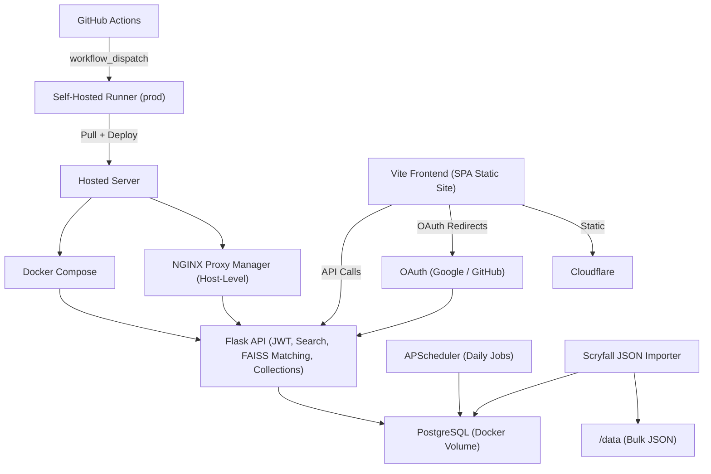

# [mtgscan.cards](https://mtgscan.cards) – Monolithic Design Documentation

## Stack Overview

* **Frontend**: React + Vite (static SPA)
* **Backend**: Flask (JWT auth, FAISS descriptor matching, database search, collection management)
* **Database**: PostgreSQL (Users, Collections, Cards)
* **Auth**: OAuth (Google/GitHub), JWT (access + refresh cookies)
* **Deployment**: GitHub Actions → Self-hosted runner → Docker Compose
* **Networking**: TLS via Cloudflare DNS + NGINX Proxy Manager

---

## Deployment Workflow

* Deployment to production is triggered manually via GitHub Actions (`workflow_dispatch`).
* The self-hosted `prod-runner` performs the following:

```bash
git pull origin prod
docker-compose down
docker-compose up -d --build
```

---

## Backup Strategy

* The `cards` table is excluded from regular SQL dumps due to size.
* Backup is performed manually with:

```bash
docker exec mtg-db pg_dump -U mtguser mtgdb --exclude-table=public.cards > backup/mtgdb_$(date +%F).sql
tar -czf backup/data_$(date +%F).tar.gz inference-backend/data
```

---

## Architecture Overview



---

## Keypoint Regression System

A dedicated ML pipeline is used to detect the four corners of MTG cards in camera-captured frames. This enables ROI (Region of Interest) normalization before descriptor-based matching.

This system is maintained in a separate repository:

* **Repo**: [simple-mtg-keypoint-regression](https://github.com/JakeTurner616/simple-mtg-keypoint-regression)
* **Export Target**: TensorFlow\.js model deployed in the frontend

### Functionality

* Generates synthetic training data using official Scryfall card images with random:

  * Backgrounds
  * Perspective and affine transformations
  * Scale, rotation, and placement
* Trains a heatmap-based keypoint model using TensorFlow + ResNet-50
* Outputs corner predictions (normalized to 1024×1024 space)
* Converts the trained Keras model to TensorFlow\.js format for in-browser inference on the frontend

### Role in Production

```text
[Input Image or Webcam Frame]
        ↓
[Keypoint Prediction (TFJS in browser)]
        ↓
[Perspective-rectified ROI]
        ↓
[Descriptor Extraction + FAISS Matching (Backend)]
        ↓
[Matched Scryfall Card ID]
```