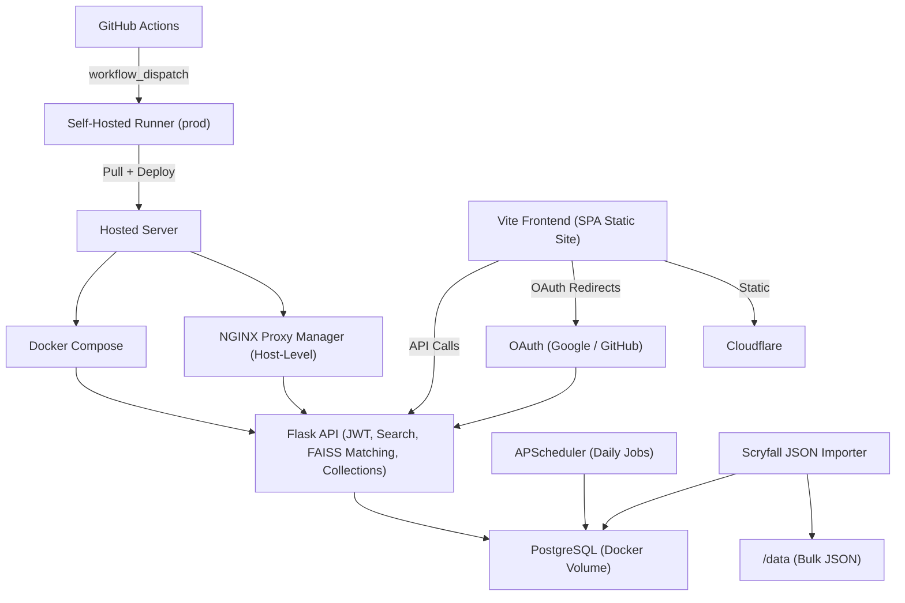

# [mtgscan.cards](https://mtgscan.cards) Monolithic Design Documentation

## Stack

- **Frontend**: React + Vite static SPA
- **Backend**: Flask (JWT auth, FAISS descriptor matching, database search, collection management)
- **Database**: PostgreSQL (Users, Collections, Cards)
- **Auth**: OAuth (Google/GitHub), JWT w/ refresh cookies
- **Deployment**: GitHub Actions → Self-hosted runner → Docker Compose
- **Networking**: TLS via Cloudflare DNS + NGINX Proxy Manager (host-level)

---

## Deployment Workflow

- Merging `main` → `prod` is done via GitHub Actions (`workflow_dispatch`).
- The `prod-runner` self-hosted runner:
  - Checks out the latest `prod` branch
  - Pulls and rebuilds with Docker Compose:

```bash
git pull origin prod
docker-compose down
docker-compose up -d --build
```

---

## Backup Strategy

* The `cards` table is excluded
* Manual execution of `backup.sh`:

```bash
docker exec mtg-db pg_dump -U mtguser mtgdb --exclude-table=public.cards > backup/mtgdb_$(date +%F).sql
tar -czf backup/data_$(date +%F).tar.gz inference-backend/data
```

---


## Architecture Overview

