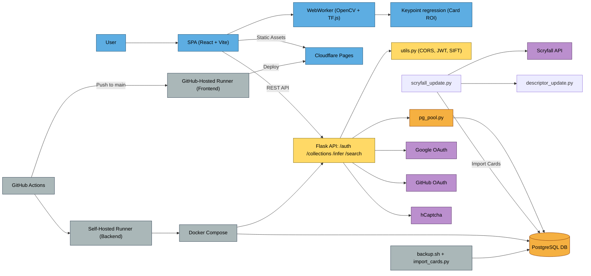

# [mtgscan.cards](https://mtgscan.cards) – Monolithic Design Documentation

## Stack Overview

* **Frontend**: React + Vite (static SPA)
* **Backend**: Flask (JWT auth, FAISS descriptor matching, database search, collection management)
* **Database**: PostgreSQL (Users, Collections, Cards)
* **Auth**: OAuth (Google/GitHub), JWT (access + refresh cookies)
* **Deployment**: GitHub Actions → Self-hosted runner → Docker Compose
* **Networking**: TLS via Cloudflare DNS + NGINX Proxy Manager

---

## Deployment Workflow

### Backend Deployment

* **Target:** Self-hosted production server
* **Triggered by:** Manual `workflow_dispatch` with input confirmation (`deploy backend`)
* **Branch:** Deploys **`main` → `prod`** (forced update before deployment)
* **Runner:** `prod-runner` (self-hosted)
* **Steps:**

  1. Force-reset `prod` to match `main`
  2. Pull and rebuild backend services:

     ```bash
     git pull origin prod
     docker-compose down
     docker-compose up -d --build
     ```

* **Deploys:**

  * Flask API (`/auth`, `/collections`, `/infer`, `/search`)
  * PostgreSQL database (`mtg-db`)
  * Background jobs (e.g., `scryfall_update.py`)
  * Volumes: `pg_data`, `scryfall_data`

---

### Frontend Deployment

* **Target:** Cloudflare Pages
* **Triggered by:** Manual `workflow_dispatch` with input confirmation (`deploy frontend`)
* **Branch:** Deploys from `prod` branch (after manual sync with `main`)
* **Runner:** GitHub-hosted runner (`ubuntu-latest`)
* **Steps:**

  1. Checkout the `prod` branch
  2. Build the frontend using Vite:

     ```bash
     npm install
     npm run build
     ```

  3. Deploy using Wrangler CLI:

     ```bash
     wrangler pages deploy vite-frontend/dist
     ```

* **Deploys:**

  * Static frontend SPA
  * Hosted globally on Cloudflare CDN

---

## Backup Strategy

* The `cards` table is excluded from regular SQL dumps due to its size.
* Backup is performed manually using:

```bash
docker exec mtg-db pg_dump -U mtguser mtgdb --exclude-table=public.cards > backup/mtgdb_$(date +%F).sql
tar -czf backup/data_$(date +%F).tar.gz inference-backend/data
````

---

## Keypoint Regression System

This system detects the four corners of MTG cards in user-submitted or live webcam frames, allowing perspective rectification before descriptor-based backend matching.

* **Repo**: [simple-mtg-keypoint-regression](https://github.com/JakeTurner616/simple-mtg-keypoint-regression)
* **Export**: TensorFlow\.js model embedded in the frontend

### Functionality

* Generates synthetic training data using Scryfall images with random:

  * Backgrounds
  * Perspective distortions
  * Scaling and rotation
* Trains on a **MobileNetV2-based lightweight heatmap regression architecture with SoftArgmax decoding**
* Outputs normalized (0–1024) card corner coordinates
* Uses **TensorFlow\.js** for in-browser inference

### Role in Production

```text
[Input Image or Webcam Frame]
        ↓
[Keypoint Prediction (TF.js in browser)]
        ↓
[Perspective-rectified ROI]
        ↓
[Descriptor Extraction + FAISS Matching (Backend)]
        ↓
[Matched Scryfall Card ID]
```

---

## Card Descriptor Matching System

The backend provides server-side card ID prediction using **FAISS-based nearest-neighbor descriptor matching with RANSAC post-filtering** for geometric consistency.

* **Repo \[`production` branch]**: [simple-mtg-feature-extraction](https://github.com/JakeTurner616/simple-mtg-feature-extraction/blob/production)
* **Model Files Hosted On**: [Hugging Face Dataset Page](https://huggingface.co/datasets/JakeTurner616/mtg-cards-SIFT-Features)

> Note: The descriptor resource bundle updated and promoted to production nightly alongside the card database.


---

### Responsibilities

* Download card images from Scryfall to memory
* Preprocess (CLAHE → grayscale)
* Extract SIFT features and normalize with RootSIFT
* Store all descriptors into `HDF5` and `.npy` temp batches
* Build and train FAISS IVF-PQ index
* Predict cards using vector similarity searching

---

### Resources Used

| File                    | Description                                               |
| ----------------------- | --------------------------------------------------------- |
| `candidate_features.h5` | Stores descriptor + keypoint data per card                |
| `faiss_ivf.index`       | Trained FAISS index with IVF-PQ                           |
| `id_map.json`           | List of Scryfall card IDs aligned to descriptors in index |

---

### Extraction & Indexing Pipeline

1. **Read card metadata** from PostgreSQL
2. **Download and CLAHE-process** images
3. **Extract SIFT features + RootSIFT normalization**
4. **Batch features** into memory-efficient `.npy` temp files
5. **Store keypoints/descriptors** in `HDF5` using gzip compression
6. **Write mapping to `id_map.json`**
7. **Build FAISS index** if missing or incomplete

---

### Inference Flow

Backend exposes an internal function for top-K card ID prediction given a URL or ROI input image.

```text
Input: Rectified ROI (256x256) image
   ↓
CLAHE + RootSIFT Feature Extraction
   ↓
FAISS Search (kNN over IVF-PQ index)
   ↓
Return most frequent card ID among matches
```

#### Example Output

```json
{
  "input": "https://cards.scryfall.io/large/front/3/3/3394cefd.jpg",
  "top_prediction": "710160a6-43b4-4ba7-9dcd-93e01befc66f",
  "top_k_matches": [
    ["710160a6-43b4-4ba7-9dcd-93e01befc66f", 52],
    ["3a2c1d6e-9985-43f2-82d8-9cd64ccbb187", 11]
  ]
}
```

---

## Descriptor Update & Promotion System

This system ensures that FAISS descriptors are updated **only after Scryfall data is refreshed** and **only if test inferences validate the new model**.

### Trigger Flow

```text
Scheduled Daily Cron (00:00)
       ↓
[scryfall_update.py]
       ↓
[descriptor_update.py]
       ↓
Sanity Check Passes?
   ├─ Yes → Promote to /resources/run
   └─ No  → Keep old model active
```

### Key Components

* `resources/staging/` — temporary storage for new HDF5, index, and ID map
* `resources/run/` — actively loaded by inference backend
* `watchdog_monitor.py` — backend file system watcher that:

  * Uses `model_lock` to queue inference during overwrite
  * Reloads resources after all writes complete (debounced)

### Safety Mechanism

* Descriptors are **never** written directly to `resources/run/`.
* A known ground-truth image is used to verify inference after new descriptor generation.
* If validation fails, `resources/run/` remains untouched and inference continues uninterrupted.

---

## Architecture Overview

